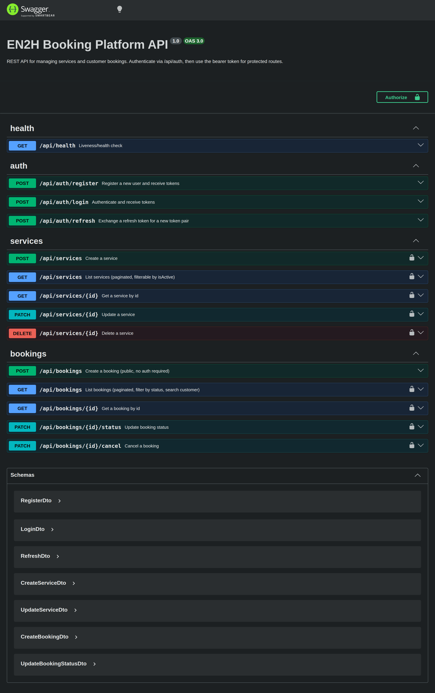
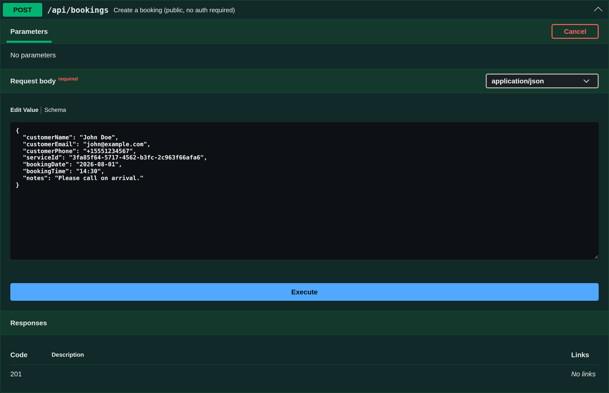

# EN2H Booking Platform API

A REST API for managing **services** and **customer bookings**, built with
**NestJS + TypeScript + PostgreSQL (TypeORM)**. Authenticated staff manage
services and bookings; customers can create bookings without an account.

## Project Overview

- **JWT authentication** with access **and** refresh tokens (rotated, hashed at rest).
- **Service management** — full CRUD, protected by JWT.
- **Booking management** — public creation, plus authenticated listing, status
  transitions, and cancellation.
- **Business rules** enforced in the service layer (see below).
- **Validation** via `class-validator` DTOs and a global `ValidationPipe`.
- **Uniform error responses** via a global exception filter.
- **Swagger** docs at `/api/docs` and a **Postman collection** in `docs/`.
- **Real TypeORM migrations** (no `synchronize`) and **Docker** for the database.

### Tech stack

| Concern    | Choice                        |
| ---------- | ----------------------------- |
| Framework  | NestJS 11                     |
| Language   | TypeScript                    |
| Database   | PostgreSQL 16                 |
| ORM        | TypeORM (migrations)          |
| Auth       | Passport JWT (access+refresh) |
| Docs       | Swagger / OpenAPI + Postman   |
| Tests      | Jest (unit + e2e)             |

## Project Structure

```
src/
  main.ts                 # bootstrap: /api prefix, ValidationPipe, filter, Swagger
  app.module.ts           # ConfigModule (validated), TypeOrmModule, feature modules
  app.controller.ts       # GET /api/health
  config/                 # env validation + shared TypeORM options
  common/                 # exception filter, pagination DTOs, decorators, transformers
  auth/                   # register/login/refresh, JWT strategies + guards
  users/                  # user entity + service
  services/               # service entity, DTOs, guarded CRUD
  bookings/               # booking entity/enum, DTOs, business rules, custom validator
db/migrations/            # committed TypeORM migration files
test/                     # e2e tests
docs/                     # Postman collection
```

## Business Rules

- A booking must reference an existing service (`404` otherwise).
- `bookingDate` cannot be in the past (`400`).
- A cancelled booking cannot be marked completed — `CANCELLED` and `COMPLETED`
  are terminal states (`409`).
- Only authenticated users can manage services (`401` otherwise).
- Customers can create bookings without authentication.
- No duplicate **active** booking for the same service + date + time (`409`),
  enforced by a partial unique index (a cancelled booking frees the slot).

## Prerequisites

- **Node.js 20+**
- **Docker** (for PostgreSQL) — or a local PostgreSQL 16 instance.

## Installation Steps

```bash
git clone <repo-url>
cd en2h-booking-api
npm install
cp .env.example .env   # then edit secrets as needed
```

## Environment Variables

Defined in `.env` (see `.env.example`). All are validated at boot; the app
refuses to start if any is missing or malformed.

| Variable                 | Description                           | Example            |
| ------------------------ | ------------------------------------- | ------------------ |
| `NODE_ENV`               | `development` / `production` / `test` | `development`      |
| `PORT`                   | HTTP port                             | `3000`             |
| `DB_HOST`                | Postgres host                         | `localhost`        |
| `DB_PORT`                | Postgres port                         | `5432`             |
| `DB_USERNAME`            | Postgres user                         | `booking`          |
| `DB_PASSWORD`            | Postgres password                     | `booking_pass`     |
| `DB_DATABASE`            | Postgres database                     | `booking_db`       |
| `JWT_ACCESS_SECRET`      | Secret for access tokens              | long random string |
| `JWT_ACCESS_EXPIRES_IN`  | Access token TTL                      | `15m`              |
| `JWT_REFRESH_SECRET`     | Secret for refresh tokens             | long random string |
| `JWT_REFRESH_EXPIRES_IN` | Refresh token TTL                     | `7d`               |

## Database Setup

Start PostgreSQL with Docker (reads credentials from `.env`):

```bash
docker compose up -d
```

This launches `postgres:16-alpine` with a healthcheck and a named volume for
persistence. To use your own PostgreSQL instead, skip this and point the `DB_*`
variables at it.

## Running Migrations

```bash
npm run migration:run       # apply all pending migrations
npm run migration:revert    # roll back the last migration
# generate a new migration after changing entities:
npm run migration:generate -- db/migrations/YourChangeName
```

Migrations are the single source of truth for the schema (`synchronize` is
disabled). The initial migration also enables the `uuid-ossp` extension.

## Running the Application

```bash
npm run start:dev     # watch mode
# or
npm run build && npm run start:prod
```

The API is served under the `/api` prefix, e.g. `http://localhost:3000/api/health`.

### Running in Docker

A multi-stage `Dockerfile` builds a lean production image:

```bash
docker compose up -d                    # start Postgres
npm run migration:run                   # apply schema
docker build -t en2h-booking-api .
docker run --rm -p 3000:3000 --env-file .env \
  -e DB_HOST=host.docker.internal en2h-booking-api
```

## Running Tests

```bash
npm test              # unit tests (business rules, validators)
npm run test:e2e      # end-to-end auth flow (needs DB running + migrated)
```

## API Documentation

- **Swagger UI:** `http://localhost:3000/api/docs` (click **Authorize** to paste
  a bearer access token).
- **OpenAPI JSON:** `http://localhost:3000/api/docs-json`.
- **Postman:** import `docs/en2h-booking-api.postman_collection.json`. It uses a
  `{{baseUrl}}` variable and auto-captures `{{accessToken}}` / `{{refreshToken}}`
  from the register/login responses.

### Endpoints

| Method | Path                       | Auth   | Description                          |
| ------ | -------------------------- | ------ | ------------------------------------ |
| GET    | `/api/health`              | –      | Health check                         |
| POST   | `/api/auth/register`       | –      | Register, returns tokens             |
| POST   | `/api/auth/login`          | –      | Login, returns tokens                |
| POST   | `/api/auth/refresh`        | –\*    | Exchange refresh token for a pair    |
| POST   | `/api/services`            | Bearer | Create service                       |
| GET    | `/api/services`            | Bearer | List services (paginated, filter)    |
| GET    | `/api/services/:id`        | Bearer | Get service                          |
| PATCH  | `/api/services/:id`        | Bearer | Update service                       |
| DELETE | `/api/services/:id`        | Bearer | Delete service (`204`)               |
| POST   | `/api/bookings`            | –      | Create booking (public)              |
| GET    | `/api/bookings`            | Bearer | List (paginated, `status`, `search`) |
| GET    | `/api/bookings/:id`        | Bearer | Get booking                          |
| PATCH  | `/api/bookings/:id/status` | Bearer | Update status                        |
| PATCH  | `/api/bookings/:id/cancel` | Bearer | Cancel booking                       |

\* `/auth/refresh` takes the refresh token in the request body.

### Quick start (curl)

```bash
# Register (returns accessToken + refreshToken)
curl -X POST http://localhost:3000/api/auth/register \
  -H 'Content-Type: application/json' \
  -d '{"email":"admin@en2h.com","password":"S3curePass!"}'

# Create a service (use the accessToken from above)
curl -X POST http://localhost:3000/api/services \
  -H "Authorization: Bearer <accessToken>" \
  -H 'Content-Type: application/json' \
  -d '{"title":"Haircut","description":"Pro cut","duration":30,"price":49.99}'

# Create a booking (public, no auth) — use the returned service id
curl -X POST http://localhost:3000/api/bookings \
  -H 'Content-Type: application/json' \
  -d '{"customerName":"John","customerEmail":"john@x.com","customerPhone":"+15551234567","serviceId":"<serviceId>","bookingDate":"2026-08-01","bookingTime":"14:30"}'
```

## Screenshots

**Swagger UI — API overview** (all endpoints grouped by tag; 🔒 marks JWT-protected routes):



**Swagger UI — Create Booking** (public endpoint with an example request body and "Try it out"):



## Assumptions Made

- **Any authenticated user** may manage all services and bookings (no separate
  admin/role model was requested), so ownership/roles are out of scope.
- **`duration`** is an integer number of **minutes**; **`price`** is a decimal.
- **`bookingTime`** is `HH:mm` 24-hour local time; **`bookingDate`** is `YYYY-MM-DD`.
  "Not in the past" is evaluated against the server's local date.
- **Status transitions** follow a small state machine: `PENDING → CONFIRMED/COMPLETED/CANCELLED`,
  `CONFIRMED → COMPLETED/CANCELLED`; `CANCELLED` and `COMPLETED` are terminal.
- The **duplicate-slot** constraint ignores cancelled bookings, so a cancelled
  slot can be rebooked.
- Refresh tokens are **rotated** on every refresh and stored only as a bcrypt hash.

## Future Improvements

- Role-based access control (admin vs staff) and per-user ownership.
- Refresh-token revocation list / logout endpoint.
- Availability/working-hours model instead of a flat unique-slot constraint.
- Rate limiting on auth endpoints and pagination cursors for large datasets.
- Broader automated coverage (services/bookings controller e2e, CI pipeline).
- Seed script and a full-stack Compose file for one-command startup.
