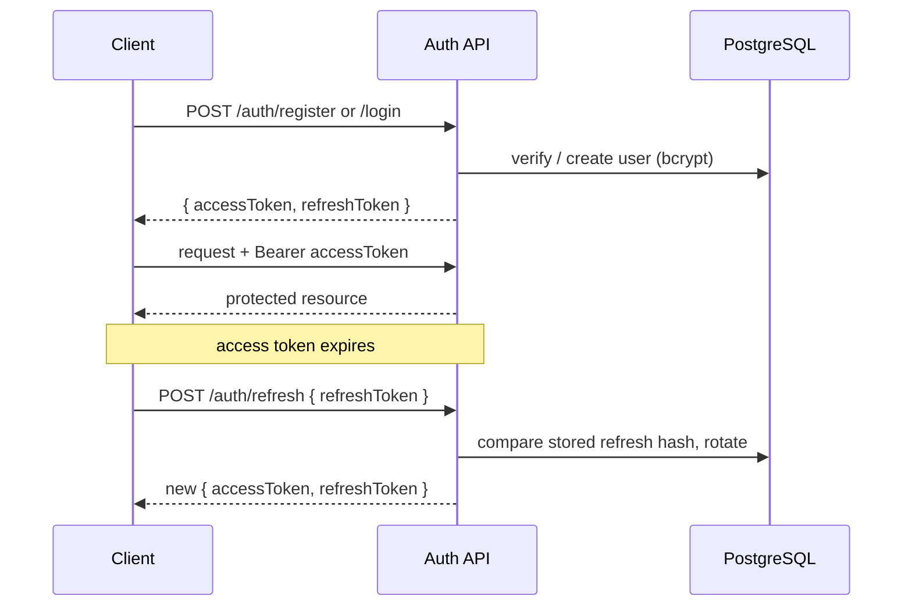
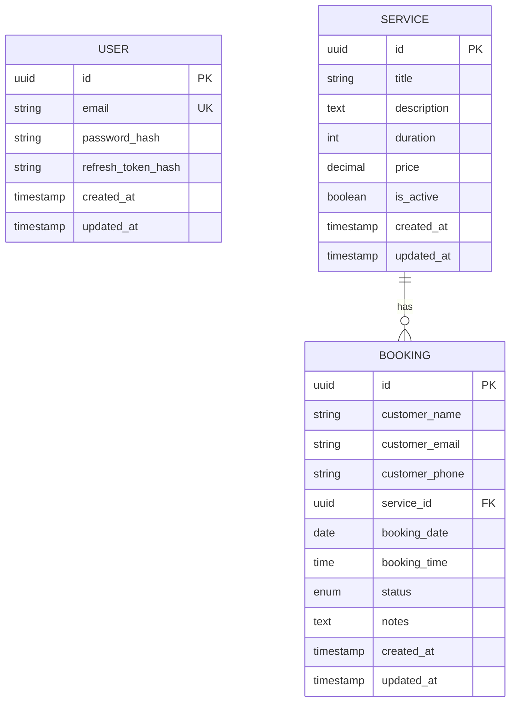

# Software Requirements Specification (SRS)
## EN2H Booking Platform API

| | |
|---|---|
| **Document version** | 1.0 |
| **Date** | 2026-07-10 |
| **Author** | Sai Kushal |
| **Status** | Final |
| **System** | EN2H Booking Platform REST API |
| **Repository** | https://github.com/Saikushal185/en2h-booking-api |

---

## Table of Contents
1. [Introduction](#1-introduction)
2. [Overall Description](#2-overall-description)
3. [Functional Requirements](#3-functional-requirements)
4. [External Interface Requirements](#4-external-interface-requirements)
5. [Data Requirements](#5-data-requirements)
6. [Non-Functional Requirements](#6-non-functional-requirements)
7. [Appendix](#7-appendix)

---

## 1. Introduction

### 1.1 Purpose
This document specifies the software requirements for the **EN2H Booking Platform
API**, a RESTful backend service that lets staff manage bookable *services* and
lets customers create and track *bookings*. It is intended for developers,
reviewers, and QA to understand the system's scope, behaviour, and constraints.

### 1.2 Scope
The system is a **backend REST API** (no bundled user interface). It provides:
- JWT-based authentication (register, login, token refresh).
- Full CRUD management of services (authenticated).
- Booking lifecycle management: public creation plus authenticated listing,
  status transitions, and cancellation.
- Enforcement of domain business rules and data validation.
- Machine-readable API documentation (OpenAPI/Swagger) and a Postman collection.

Out of scope: web/mobile front-ends, payment processing, notifications,
role-based authorization, and multi-tenant separation.

### 1.3 Definitions, Acronyms, and Abbreviations
| Term | Meaning |
|---|---|
| **API** | Application Programming Interface |
| **JWT** | JSON Web Token |
| **CRUD** | Create, Read, Update, Delete |
| **DTO** | Data Transfer Object |
| **ORM** | Object-Relational Mapping |
| **Service** | A bookable offering (e.g. a haircut) with duration and price |
| **Booking** | A customer's reservation of a service at a date/time |
| **Access token** | Short-lived JWT authorizing protected requests |
| **Refresh token** | Long-lived JWT used to obtain a new token pair |

### 1.4 References
- Assignment brief: *EN2H Software Engineer Intern (NestJS) – Technical Assignment*.
- NestJS documentation — https://docs.nestjs.com
- TypeORM documentation — https://typeorm.io
- OpenAPI Specification 3.0.

### 1.5 Overview
Section 2 gives the overall product context. Section 3 details functional
requirements per feature. Sections 4–5 define interfaces and data. Section 6
covers non-functional requirements. Section 7 is an appendix of conventions.

---

## 2. Overall Description

### 2.1 Product Perspective
The API is a self-contained, stateless service backed by a PostgreSQL database.
Clients (web apps, mobile apps, Postman, or curl) communicate over HTTP/JSON.
The service is designed to run behind a reverse proxy and scale horizontally,
since all session state lives in signed tokens and the database.

```
[ Client / Postman / curl ]  --HTTPS/JSON-->  [ EN2H Booking API (NestJS) ]  -->  [ PostgreSQL ]
```

### 2.2 Product Functions (summary)
- **F1** Register and authenticate users; issue and refresh JWT token pairs.
- **F2** Create, read, update, and delete services (authenticated).
- **F3** Create bookings without authentication (customers).
- **F4** List, retrieve, transition status, and cancel bookings (authenticated).
- **F5** Validate all input and return consistent, structured errors.
- **F6** Publish interactive API documentation.

### 2.3 User Classes and Characteristics
| User class | Description | Access |
|---|---|---|
| **Customer** | Books a service; no account required | Public booking creation only |
| **Authenticated user (staff)** | Registered user managing the platform | Full service + booking management |
| **API consumer / integrator** | Uses Swagger/Postman to integrate | Per-endpoint auth rules |

### 2.4 Operating Environment
- **Runtime:** Node.js 20 LTS.
- **Framework:** NestJS 11 (TypeScript).
- **Database:** PostgreSQL 16.
- **Containerization:** Docker (PostgreSQL via Compose; app image via Dockerfile).
- **Protocol:** HTTP/1.1, JSON request/response bodies.

### 2.5 Design and Implementation Constraints
- Must be implemented with **NestJS + TypeScript**.
- Schema changes must be delivered as **TypeORM migration files**
  (`synchronize` disabled).
- Secrets must be provided via environment variables; none committed to VCS.
- Must follow REST conventions and NestJS modular architecture.

### 2.6 Assumptions and Dependencies
- Any authenticated user may manage all services and bookings (no role model).
- `duration` is an integer count of minutes; `price` is a non-negative decimal.
- `bookingDate` = `YYYY-MM-DD`; `bookingTime` = `HH:mm` (24-hour, server-local).
- A PostgreSQL instance is reachable using the configured environment variables.

---

## 3. Functional Requirements

Each requirement lists **inputs**, **processing/rules**, **output**, and
**error conditions**. IDs are stable references for traceability.

### 3.1 Authentication (F1)

**FR-1.1 Register**
- **Input:** `{ email, password }` (email format; password 8–72 chars).
- **Processing:** Reject if email already exists; hash password with bcrypt;
  persist user; issue an access + refresh token pair; store the refresh token's
  hash.
- **Output:** `201 Created` → `{ accessToken, refreshToken }`.
- **Errors:** `400` invalid body; `409` email already registered.

**FR-1.2 Login**
- **Input:** `{ email, password }`.
- **Processing:** Verify credentials with bcrypt; on success issue a new token pair.
- **Output:** `200 OK` → `{ accessToken, refreshToken }`.
- **Errors:** `400` invalid body; `401` invalid credentials.

**FR-1.3 Refresh Token**
- **Input:** `{ refreshToken }` (valid JWT).
- **Processing:** Verify signature/expiry; compare against the stored per-user
  hash; on success **rotate** — issue a new pair and replace the stored hash.
- **Output:** `200 OK` → `{ accessToken, refreshToken }`.
- **Errors:** `401` missing/invalid/rotated-out refresh token.

### 3.2 Service Management (F2) — requires a valid access token

**FR-2.1 Create Service** — `POST /services`
- **Input:** `{ title, description, duration, price, isActive? }`.
- **Output:** `201 Created` → the created service.
- **Errors:** `400` invalid body; `401` unauthenticated.

**FR-2.2 List Services** — `GET /services`
- **Input:** query `page`, `limit`, optional `isActive`.
- **Output:** `200 OK` → `{ data: Service[], meta: { total, page, limit, totalPages } }`.
- **Errors:** `400` invalid query; `401` unauthenticated.

**FR-2.3 Get Service by ID** — `GET /services/:id`
- **Output:** `200 OK` → service; **Errors:** `400` bad UUID, `401`, `404` not found.

**FR-2.4 Update Service** — `PATCH /services/:id`
- **Input:** partial service fields. **Output:** `200 OK` → updated service.
- **Errors:** `400`, `401`, `404`.

**FR-2.5 Delete Service** — `DELETE /services/:id`
- **Output:** `204 No Content`. **Errors:** `401`, `404`. A service referenced by
  bookings cannot be deleted (FK `RESTRICT`) → `409`.

### 3.3 Booking Management (F3, F4)

**FR-3.1 Create Booking (public)** — `POST /bookings`
- **Input:** `{ customerName, customerEmail, customerPhone, serviceId,
  bookingDate, bookingTime, notes? }`.
- **Processing / business rules:**
  - **BR-1** The `serviceId` must reference an existing service, else `404`.
  - **BR-2** `bookingDate` must not be in the past, else `400`.
  - **BR-6** No duplicate *active* booking for the same `(serviceId,
    bookingDate, bookingTime)`, else `409` (enforced by a partial unique index).
  - New bookings start in status `PENDING`.
- **Output:** `201 Created` → the created booking.
- **Errors:** `400`, `404`, `409`.

**FR-3.2 List Bookings** — `GET /bookings` (authenticated)
- **Input:** query `page`, `limit`, optional `status`, optional `search`
  (matches customer name or email, case-insensitive).
- **Output:** `200 OK` → paginated envelope. **Errors:** `400`, `401`.

**FR-3.3 Get Booking by ID** — `GET /bookings/:id` (authenticated)
- **Output:** `200 OK` → booking with its service. **Errors:** `400`, `401`, `404`.

**FR-3.4 Update Booking Status** — `PATCH /bookings/:id/status` (authenticated)
- **Input:** `{ status }` ∈ enum.
- **Processing:** Allowed transitions only (see BR-3); `CANCELLED` and
  `COMPLETED` are terminal.
- **Output:** `200 OK` → updated booking.
- **Errors:** `400` invalid status; `401`; `404`; `409` illegal transition
  (**BR-3**: a `CANCELLED` booking can never become `COMPLETED`).

**FR-3.5 Cancel Booking** — `PATCH /bookings/:id/cancel` (authenticated)
- **Processing:** Sets status to `CANCELLED`; a `COMPLETED` booking cannot be
  cancelled.
- **Output:** `200 OK` → cancelled booking. **Errors:** `400` (already
  completed); `401`; `404`.

### 3.4 Consolidated Business Rules
| ID | Rule | Enforcement |
|---|---|---|
| BR-1 | A booking must belong to an existing service | Service lookup → `404` |
| BR-2 | Booking dates cannot be in the past | Custom validator + service check → `400` |
| BR-3 | Cancelled bookings cannot be marked completed | State machine → `409` |
| BR-4 | Only authenticated users can manage services | `JwtAuthGuard` → `401` |
| BR-5 | Customers can create bookings without authentication | Public route |
| BR-6 | No duplicate active booking for same service/date/time | Partial unique index → `409` |

---

## 4. External Interface Requirements

### 4.1 API Interface
- **Base URL:** `/api` (e.g. `http://localhost:3000/api`).
- **Content type:** `application/json`.
- **Auth scheme:** `Authorization: Bearer <accessToken>` on protected routes.
- **Docs:** Swagger UI at `/api/docs`; OpenAPI JSON at `/api/docs-json`.

| # | Method | Path | Auth | Requirement |
|---|---|---|---|---|
| 1 | GET | `/api/health` | – | Health check |
| 2 | POST | `/api/auth/register` | – | FR-1.1 |
| 3 | POST | `/api/auth/login` | – | FR-1.2 |
| 4 | POST | `/api/auth/refresh` | – | FR-1.3 |
| 5 | POST | `/api/services` | Bearer | FR-2.1 |
| 6 | GET | `/api/services` | Bearer | FR-2.2 |
| 7 | GET | `/api/services/:id` | Bearer | FR-2.3 |
| 8 | PATCH | `/api/services/:id` | Bearer | FR-2.4 |
| 9 | DELETE | `/api/services/:id` | Bearer | FR-2.5 |
| 10 | POST | `/api/bookings` | – | FR-3.1 |
| 11 | GET | `/api/bookings` | Bearer | FR-3.2 |
| 12 | GET | `/api/bookings/:id` | Bearer | FR-3.3 |
| 13 | PATCH | `/api/bookings/:id/status` | Bearer | FR-3.4 |
| 14 | PATCH | `/api/bookings/:id/cancel` | Bearer | FR-3.5 |

### 4.2 Software Interfaces
- **PostgreSQL 16** via TypeORM (driver `pg`).
- **Configuration** via environment variables (validated at boot): `NODE_ENV`,
  `PORT`, `DB_HOST`, `DB_PORT`, `DB_USERNAME`, `DB_PASSWORD`, `DB_DATABASE`,
  `JWT_ACCESS_SECRET`, `JWT_ACCESS_EXPIRES_IN`, `JWT_REFRESH_SECRET`,
  `JWT_REFRESH_EXPIRES_IN`.

### 4.3 Authentication Flow


---

## 5. Data Requirements

### 5.1 Entity-Relationship Model


### 5.2 Entities
- **User** — application user. `email` is unique. Passwords and refresh tokens
  are stored only as hashes.
- **Service** — a bookable offering. `duration` in minutes, `price` decimal(10,2),
  `is_active` defaults `true`.
- **Booking** — a customer reservation referencing a service. `status` is an
  enum (`PENDING`, `CONFIRMED`, `CANCELLED`, `COMPLETED`), default `PENDING`.

### 5.3 Constraints & Indexes
- `users.email` — unique index.
- `bookings.service_id` — foreign key to `services.id`, `ON DELETE RESTRICT`.
- `bookings (service_id, booking_date, booking_time)` — **partial unique index**
  `WHERE status <> 'CANCELLED'` (implements BR-6; cancelled slots are reusable).

### 5.4 Booking Status State Machine
```
PENDING ──▶ CONFIRMED ──▶ COMPLETED
   │            │
   └────────────┴──────▶ CANCELLED
CANCELLED, COMPLETED = terminal (no outgoing transitions)
```

---

## 6. Non-Functional Requirements

### 6.1 Security
- **NFR-SEC-1** Passwords hashed with bcrypt; never stored or returned in plaintext.
- **NFR-SEC-2** Refresh tokens stored as a SHA-256→bcrypt hash and **rotated** on
  every refresh; rotated-out tokens are rejected.
- **NFR-SEC-3** Stateless JWT auth; access tokens short-lived, refresh tokens
  long-lived, with independently configured secrets.
- **NFR-SEC-4** Input strictly validated; unknown properties rejected
  (`forbidNonWhitelisted`).
- **NFR-SEC-5** Secrets supplied via environment only; `.env` is git-ignored.

### 6.2 Reliability & Error Handling
- **NFR-REL-1** All errors return a uniform JSON shape (see 7.2) with correct
  HTTP status codes.
- **NFR-REL-2** Configuration is validated at startup; the app fails fast on
  misconfiguration.
- **NFR-REL-3** Database race on duplicate bookings is caught at the DB layer and
  surfaced as `409`.

### 6.3 Performance & Scalability
- **NFR-PERF-1** List endpoints are paginated (default 10, max 100 per page).
- **NFR-PERF-2** Stateless design allows horizontal scaling behind a load balancer.

### 6.4 Maintainability
- **NFR-MNT-1** Modular NestJS architecture (feature modules, DTOs, guards,
  filters); ESLint/Prettier enforced with zero warnings.
- **NFR-MNT-2** Schema evolves only through committed TypeORM migrations.
- **NFR-MNT-3** Automated tests (unit for business rules, e2e for auth flow).

### 6.5 Portability
- **NFR-PORT-1** Runs on any platform with Node.js 20 and PostgreSQL 16; Docker
  provided for the database and a production app image.

### 6.6 Usability (Documentation)
- **NFR-USE-1** Interactive Swagger UI and an importable Postman collection.
- **NFR-USE-2** README with setup, configuration, migration, and run instructions.

---

## 7. Appendix

### 7.1 HTTP Status Codes Used
| Code | Meaning in this API |
|---|---|
| 200 | Successful read/update |
| 201 | Resource created |
| 204 | Deleted (no content) |
| 400 | Validation error / malformed input |
| 401 | Missing or invalid authentication |
| 404 | Resource not found |
| 409 | Conflict (duplicate email, duplicate slot, illegal transition) |
| 500 | Unexpected server error |

### 7.2 Standard Error Response Shape
```json
{
  "statusCode": 400,
  "error": "Bad Request",
  "message": ["bookingDate cannot be in the past"],
  "path": "/api/bookings",
  "timestamp": "2026-07-10T10:00:00.000Z"
}
```

### 7.3 Traceability Summary
| Assignment requirement | SRS reference |
|---|---|
| JWT authentication (register, login) | FR-1.1, FR-1.2 |
| Service CRUD | FR-2.1 … FR-2.5 |
| Booking APIs | FR-3.1 … FR-3.5 |
| Business rules | BR-1 … BR-6 |
| Validation & error handling | NFR-SEC-4, NFR-REL-1 |
| Database design & migrations | Section 5, NFR-MNT-2 |
| API documentation | Section 4.1, NFR-USE-1 |
| Bonus: refresh token, pagination, search, filter, duplicate prevention, Docker | FR-1.3, FR-2.2/FR-3.2, BR-6, Section 2.4 |
